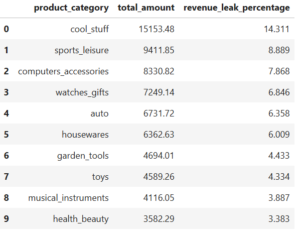
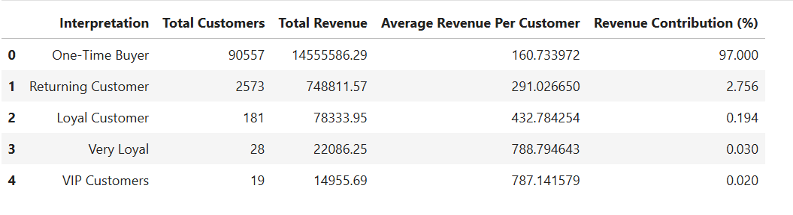

# E-commerce Customer & Revenue Analysis Using SQL and Python
<p>Analyzing customer behavior and revenue patterns to uncover business insights and growth opportunities in a Brazilian e-commerce marketplace.</P>


<br>

<p>This project analyzes customer behavior and revenue patterns for a Brazilian e-commerce marketplace using historical order data. The goal is to identify key customer segments, understand purchase frequency and recency, and evaluate the drivers of revenue and regional growth. Insights from this analysis highlight opportunities for improving customer retention and long-term business value.</p>

*Image Source: [Google Images](https://retalon.com/thought-leadership/translate-data-into-action)* <br>
*Date Source: [Kaggle](https://www.kaggle.com/datasets/olistbr/brazilian-ecommerce)*

 <h2>Table Of Contents </h2>

<ol>
<li><a href="#Overview"><h3> Project Overview </h3> </a></li>
<li><a href="#data"><h3> Dataset </h3> </a></li>
<li><a href="#questions"><h3> Business Questions Covered </h3> </a></li>
    <ul>
    <li>
    <a href="#revenue_leakage"><b> 3.1 Revenue Leakage:</b></a>
            <ol type="a">
            <li> What is the company’s current baseline revenue?</li>
            <li> What is the current level of revenue leakage?</li>
            <li> What is the current distribution of order statuses across all orders?</li>
            <li> Are there specific product categories with a high frequency of order cancellations? </li>
            <li> Is there a relationship between a high number of cancellations and increased revenue loss? </li>
            </ol>
    </li>
    <li>
    <a href='#rfm'><b> 3.2 Customer Segmentation(RFM Analysis):</b></a>
            <ol type="a">
            <li> What is the current customer recency profile? </li>
            <li> What are the purchasing frequency patterns among customers? </li>
            <li> Is revenue primarily driven by order volume or by high-value customers? </li>
            </ol>
    </li>
    <li> 
    <a href='#growth'><b> 3.3 Regional Performance With Growth Trends: </b></a>
            <ol type="a">
            <li> How is revenue distributed across states?</li>
            <li> How is order volume distributed across states?</li>
            <li>Are high-revenue states driven by higher order volume or higher average order value (AOV)? </li>
            <li> What is the trend between revenue and order volume over time for top-performing states?</li>
            </ol>
    </ul>
<li><a href="#tech"><h3> Tech Stack </h3> </a></li>
<li><a href="#structure"><h3> Project Structure  </h3> </a></li>
</ol>


<h2 id="Overview">1. Project Overview</h2>
<p>This project analyzes the <b>revenue leakage</b>, <b>customer segmentation (RFM)</b> and <b> regional performance with growth trends</b> for a Brazilian e-commerce marketplace using historical order data. The goal is to identify the source of revenue leakage, key customer segments, understand purchase frequency and recency, and evaluate the drivers of revenue and regional growth. Insights from this analysis highlight opportunities for improving customer retention and long-term business value.</p>


<h2 id="data">2. Dataset</h2>
The analysis uses the Olist e-commerce dataset, which includes historical information about customers, orders, payments, products, geo-location, and sellers across Brazil. Only <b>delivered </b> orders were considered for revenue-related analyses to ensure accurate evaluation of realized revenue. <br>
<br>

The image below represents the schema for the database:


*Image Source: [Google Images](https://i.imgur.com/HRhd2Y0.png)*


<h2 id="questions">3. Business Questions Covered</h2>

<h3>NOTE:</h3> Charts are built using <b>Plotly</b> and GitHub doesn't render interactive charts Each section includes a link, click the link
stated as <b> Open Notebook🔗</b> to view the full notebook with an interactive charts in a new tab with an option below:

(`Ctrl+Click` / `Cmd+Click`)


<h3 id='revenue_leakage'> 3.1 Revenue Leakage: </h3> 
<a href='https://nishan-k.github.io/E-commerce-SQL-Analytics/02_Revenue_Leakage_Analysis.html#baseline-revenue-metrics'> Open Notebook🔗 </a>

<hr>

<h4> a. What is the company’s current baseline revenue?</h4>

- Total market opportunity: **R\$15.84M**.
- Total revenue loss from order cancellation: **R\$0.11M**.
- Total revenue realized: **R\$15.42M**

<hr>

<h4> b. What is the current level of revenue leakage?</h4>
- The current revenue leakage is <b> below 1% (0.69%) </b> suggesting an effective order fulfillment and a low order cancellation impact.

<hr>

<h4> c. What is the current distribution of order statuses across all orders?</h4>
- A total count of 8 order status. They are: <br>


- `delivered`: <b> 96,478 </b>
- `shipped`:  <b> 1,107 </b>
- `canceled`:  <b> 625 </b>
- `unavailable`:  <b> 609</b>
- `invoiced`:  <b> 314 </b>
- `processing`:  <b> 301 </b>
- `created`:  <b> 5 </b>
- `approved`:  <b> 2 </b>

There are two layers for the `canceled` orders, `with-items` and `without-items`.
1. Canceled orders **with-items**: 461
2. Canceled orders **without-items**: 164

Out of **625** canceled orders, **461** had items `(hard revenue loss)`, and **164** were canceled before item-level data was recorded `(soft revenue loss)`.

<hr>

<h4> d. Are there specific product categories with a high frequency of order cancellations?</h4>
- These are the <b>top 10 product categories</b> in descending order with the <b>total amount lost and their revenue leakage in %</b> whose order gets canceled too often:
<br>
<br>



<hr>

<h4> e. Is there a relationship between a high number of cancellations and increased revenue loss?</h4>

- All the `product categories` follows a linear relationship where higher cancellations lead to higher revenue loss with just one exception, i.e. `cool_stuff` category, it has the highest revenue loss **R$ 15,153.48** despite low cancellations (**16**), `sports_leisure` faces the highest number of order cancellation of **51** and has a revenue loss of **R$ 9,411.85**.

<hr>

<h3 id='rfm'> 3.2 Customer Segmentation (RFM Analysis): </h3> 
<a href='https://nishan-k.github.io/E-commerce-SQL-Analytics/03_Customer_Segmentation_(RFM%20Analysis).html'> Open Notebook🔗 </a>

<hr>

<h4> a. What is the current customer recency profile?</h4>

- On average, customers take approximately **248 days** to place their `second purchase`, indicating a `long repurchase cycle`.

- Out of **96,478 customers**, only **18,741** return within **1–100 days**, while the majority (**45,240 customers**) make a `second purchase between` **100–300 days**.

- A significant portion of customers show very long gaps between purchases, with **25,406 customers** returning after **300–500 days**, and **7,091** customers taking more than **500 days**.

- Overall, repeat purchasing behavior is `heavily concentrated` in the **100–300 day window**, suggesting `low short-term retention and a slow repeat-purchase cycle`.

<hr>

<h4> b. What are the purchasing frequency patterns among customers?</h4>

- The analysis is done by segmenting the customers into `5 different segements`:

1. `One-Time Buyer:` **1 order**
2. `Returning Customer:` **2 orders**
3. `Loyal Customer:` **3 orders**
4. `Very Loyal Customer:` **4 orders**
5. `VIP Customers`: **5 or more orders**

- Where, the `One-Time Buyer` domniates the customer base accounting for **96.947%**, a total of **90,557 customers**.
- `Returning` **(2.756% or 2,573 customers)** and `Loyal` **(0.194% or 181 customers)** form a much smaller but strategically important segment.
- `Very Loyal` **(0.030% or 28 customers)** and `VIP` **(0.020% or 19)** customers represent a very small fraction but are likely to contribute disproportionately higher lifetime value.

<hr>

<h4> c. Is revenue primarily driven by order volume or by high-value customers?</h4>

- Order volume is the **KEY** revenue driver. The companys revenue `heavily relies on the One-Time Buyer`, with a total of **90,557** customers, `a total revenue` of **R$ 14.55 M**, with `an average revenue` of **R$ 160.73** per customer, and a `revenue contribution` of **97.00 %.**
- The `value of the customer increases as the customer counts for their second purchase starts decreasing`, although, revenue contribution (%) for the rest of the segments except `One-Time Buyer` is **< 2.7%**, value wise, the company earns on an average of **R$ 291.02 to R$ 787.14** per customer in other remaining `4 segments` while the average revenue per customer for `One-Time Buyer` is just **R$ 160.73.**
- A table below summarizes the **Volume Vs Value** for the company:



<hr>


<h3 id='growth'> 3.3 Regional Performance With Growth Trends: </h3> 
<a href='https://nishan-k.github.io/E-commerce-SQL-Analytics/04_Regional_Performance_with_Growth_Trends.html'> Open Notebook🔗 </a>

<hr>

<h4> a. How is revenue distributed across states?</h4>

- Out of **27** states, `São Paulo` is the highest revenue-generating state, contributing **R$ 5,773,869.02 (37.44% of total revenue).**

- `Roraima` is the lowest revenue-generating state, contributing **R$ 9,039.52 (0.06% of total revenue).**

<hr>


<h4> b. How is order volume distributed across states?</h4>

- `São Paulo` has the highest volume (**40,519 orders or 42.0%**) for orders and is also the highest revenue generating state.

- `Roraima` has the lowest volume (**41 orders or 0.04%**) for orders and is also the lowest revenue generating state.

The `Volume of Order and Revenue Generation` has a linear relationship for majority of the states.

<hr>

<h4> c. Are high-revenue states driven by higher order volume or higher average order value (AOV)?</h4>

- `Paraíba` state has the highest `AOV` of **1.68x** but is the lowest revenue generating state, contributing **0.89%** in the `total revenue`, with the lowest number of orders contribution **0.53%** in the `total order-volume.`
- `São Paulo` state has the lowest `AOV` of **0.89x** but is the `highest revenue generating state`, with a contribution of **37.44%**, in `the total revenue`, with the highest number of orders contribution **42.00%**, in `the total order-volume.`
- `AOV and Order volume` shows `an inverse relationship`, several states exhibit high AOV but low order volume, `indicating premium but niche markets.`

<hr>

<h4> d. What is the trend between revenue and order volume over time for the top-performing states?</h4>

- Revenue and order volume exhibit nearly identical growth patterns, indicating that `revenue growth is primarily driven by increasing order volume rather than price effects.`
- `São Paulo` consistently leads across time with `the highest order volume` of **46,448.00** and `shows the steepest growth trajectory, significantly outperforming other states.`
- `São Paulo` is also the` highest revenue-generating state` of **$R5,769,703.15**, reinforcing its role as the primary growth engine for the business.


<h2 id="tech">4. Tech Stack</h2>

- Programming and analysis:
    - Python (Pandas, NumPy)
    - SQL (JOINS, AGGREGATION, WINDOW FUNCTIONS)

- Data visualization:
    - Plotly (interactive charts)
    - Matplotlib

- Environment and tools:
    - Anaconda (virtual environment)
    - Jupyter Notebook
    - GitHub (version control and project hosting)


<h2 id="structure">5. Project Structure</h2>
 <hr>


```
├── data/  
│   └── raw/                  # Raw CSV files used to create the e-commerce database  
├── docs/                     # Exported HTML notebooks for GitHub viewing  
├── notebooks/                # Jupyter notebooks with analysis, interactive visuals, and insights  
├── plots/                    # Reusable Python functions for Plotly visualizations  
├── plot_html/                # Interactive Plotly charts saved as HTML  
├── sql/                      # SQL queries used for metric calculations  
│   ├── 02_Revenue_Leakage_Analysis/  
│   ├── 03_Customer_Segmentation_(RFM_Analysis)/  
│   └── 04_Regional_Performance_with_Growth_Trends/  
├── src/                      # Python modules executing SQL and computing metrics  
│   ├── revenue_leakage/  
│   ├── rfm_analysis/  
│   └── regional_performance/  
└── utils/                    # Helper and utility functions
```    